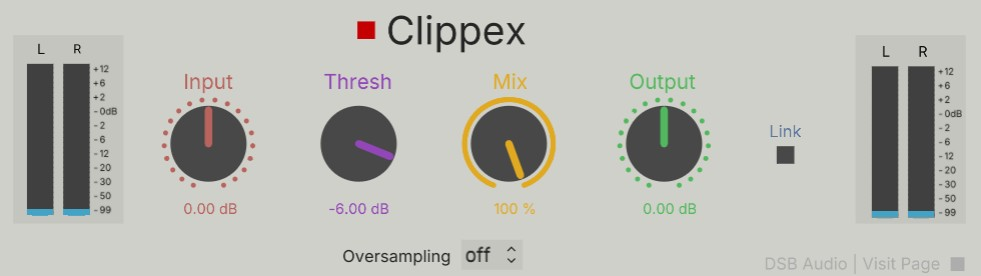

# Clippex
Soft Clip plugin for plugdata VST

🔌 Clippex – Soft Clipper for PlugData
Clippex is a simple and effective Soft Clip patch designed for PlugData, optimized for use as a VST plugin inside any DAW.

Ideal for saturation, loudness shaping, and peak control, Clippex adds transparent limiting while introducing gentle harmonic distortion, keeping your signal musical and clean.

🎛️ Features
🧪 Soft clipper patch with smooth saturation curve

🌀 PlugData-optimized for VST/AU deployment

🎧 Ideal for drums, bass, synths or master bus shaping

🐾 Minimal interface for quick integration

💾 Savestate-compatible for session recall

🧰 Usage
Just load Clippex in PlugData and insert it in your signal chain. Works seamlessly as a plugin inside your DAW.

You can adjust internal parameters for clipping depth and threshold to modify the shape depending on your patching needs or desired coloration.

📁 Included Files
Clippex.pd → main soft clip patch

README.md → this documentation

Clippex.cmb → plugin only for reason users to matching the native experience of the DAW

✅ Requirements
PlugData installed

Basic understanding of Pure Data/PlugData patching

👤 Credits
Developed by Diego @ DSB AUDIO Powered by Pure Data + PlugData community ❤️
